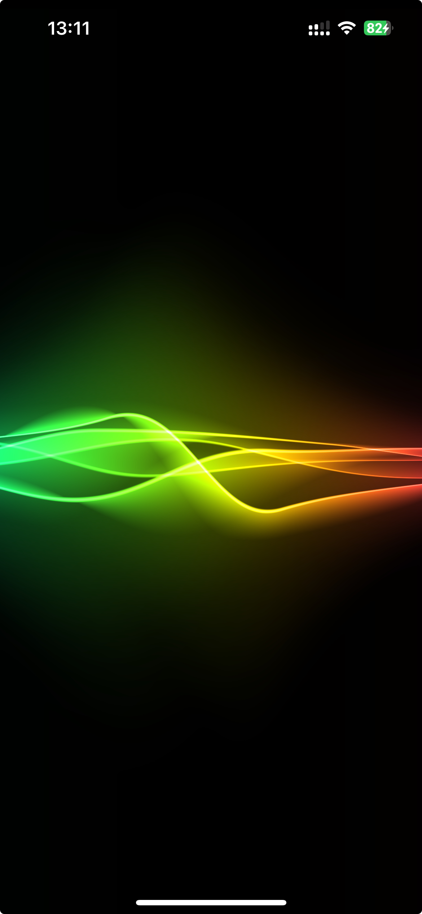

# Glowing Waves Metal and SwiftUI experiment

This project is a SwiftUI application utilizing MetalKit, inspired by the GLSL shader Chromatic Resonance by Philippe Desgranges.
GLSL source: https://www.shadertoy.com/view/tlySzm

## Attribution

- GLSL Concept: Philippe Desgranges
- Email: [Philippe.desgranges@gmail.com](mailto:Philippe.desgranges@gmail.com)
- License: [Creative Commons Attribution-NonCommercial-ShareAlike 3.0 Unported License](https://creativecommons.org/licenses/by-nc-sa/3.0/)
